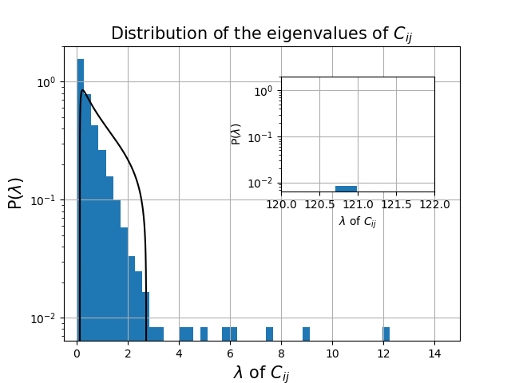
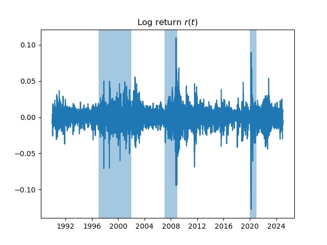
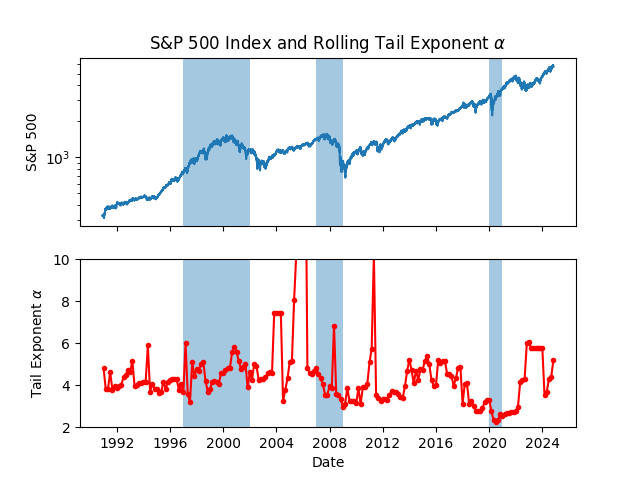

# Quantitative-Finance

## Market crashes

In the folder market crashes one can find the analysis of the log returns and of the rolling tail exponent for the S&P 500 index with a particular focus on their behaviors during the market crashes of 2000, 2008, 2020.

